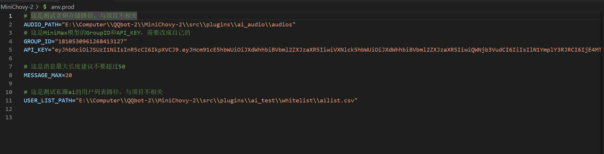

# nonebot-plugins-ai_audio
用于QQ聊天机器人的只能回答语音，不输出文本，只播放语音文件。

# 安装
首先要电脑上有python环境，然后需要有Lagrange.OneBot，下载地址:<https://github.com/LagrangeDev/Lagrange.Core/releases>

进入cmd命令行，输入：
```
pip install nb-cli
```
如果出现报错，需要进行强制重新安装pip：
```
python -m pip install --upgrade pip --force-reinstall
```

进入一个完全英文的文件夹，例如我的是`E:\\Computer\\QQbot-2\\`

使用vscode打开这个文件夹，在终端输入：
```
nb init
```

然后搭建nonebot环境

```
nb create
```

选择'simple（插件开发者）'


所有设置选择如下图所示：


然后进入项目文件夹，打开项目文件夹，将'Lagrange.OneBot.exe'放到这个文件夹中并启动，第一次启动生成配置文件，关闭后再启动并扫描生成的`qr-0.png`二维码。

也可以使用`exe Runner`这个插件启动`Lagrange.OneBot.exe`，启动两次，第二次在vscode终端栏目会出现二维码，扫描后即可登录。不过这个要等待一会生成二维码。


二维码：


最后一步需要使用`GPT-SoVITS`模型，我这里使用的是B站白菜工厂1145号员工大佬的整合训练的内容，参考视频：<https://www.bilibili.com/video/BV14a4y1S7LX/>

使用vscode打开之前机器人的项目文件夹，将我的所有代码复制到`plugins`文件夹中，就像这样：


记得将`.env.prod`文件夹中的内容修改



# 运行

在vscode终端中使用命令：
```
nb run --reload
```

运行`Lagrange.OneBot.exe`，运行之前下载的 `GPT-SoVITS` 模型，然后就可以在QQ中测试了。

在QQ群聊中发送`/AI音频`，机器人就会回复语音了。